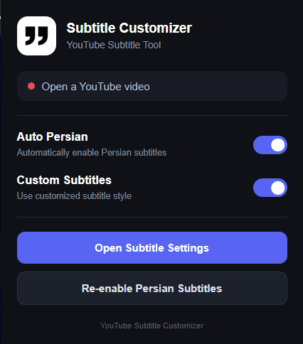
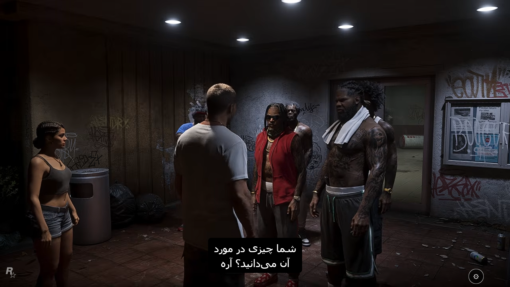
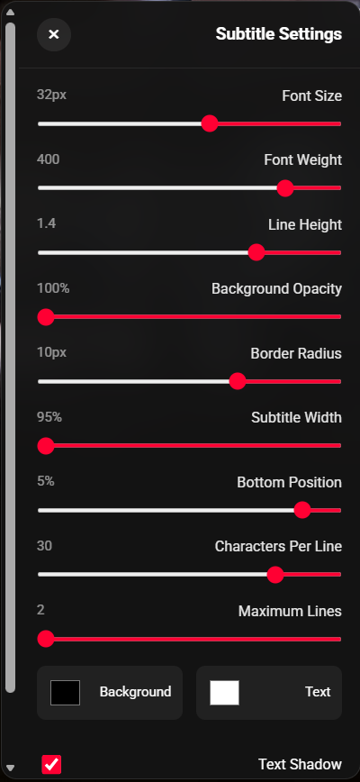

# YouTube Subtitle Customizer

A lightweight Chrome extension for customizing YouTube subtitles, with automatic Persian subtitle translation and a dedicated in-video settings panel.


## Overview

**YouTube Subtitle Customizer** replaces YouTube's native caption presentation with a cleaner, customizable subtitle renderer while keeping YouTube's subtitle system as the source.

The extension is designed with a particular focus on **Persian auto-translated captions**, including better readability for right-to-left text, controlled line wrapping, and convenient subtitle positioning.

No build system, framework, or external service is required.

## Features

- Automatically enable YouTube captions and switch them to **Persian auto-translation**
- Replace YouTube's native subtitle display with a custom renderer
- Automatically detect **RTL Persian/Arabic** and switch text direction
- Smart subtitle line breaking and two-line balancing
- Center subtitles horizontally while keeping vertical position configurable
- In-video **Subtitle Settings** panel
- Persistent subtitle customization with `chrome.storage.local`
- Custom controls for:
  - Font size
  - Font weight
  - Line height
  - Text color
  - Background color
  - Background opacity
  - Border radius
  - Subtitle width
  - Bottom position
  - Characters per line
  - Maximum lines
  - Text shadow
- Quick enable/disable control for custom subtitles from the extension popup
- Reset settings to their defaults
- YouTube status detection from the extension popup
- Built with **Chrome Manifest V3**

## Screenshots

### Extension Popup



### Customized Subtitles



### Subtitle Settings



## Installation

The extension can currently be installed locally through Chrome Developer Mode.

### 1. Download the repository

Clone the project:

```bash
git clone https://github.com/pedimmdi/youtube-subtitle-customizer.git
```

Or download the repository as a ZIP file from GitHub and extract it.

### 2. Open Chrome Extensions

Open:

``	ext
chrome://extensions/
```

Enable **Developer mode**.

### 3. Load the extension

Click **Load unpacked** and select the project root directory:

``	ext
youtube-subtitle-customizer/
```

The directory you select should contain `manifest.json`.

### 4. Open YouTube

Open a YouTube video that has captions available.

The extension should initialize automatically. You can also open the extension popup and use:

- **Auto Persian** to control automatic Persian subtitle selection
- **Custom Subtitles** to enable or disable the custom subtitle renderer
- **Open Subtitle Settings** to customize the subtitle appearance
- **Re-enable Persian Subtitles** to trigger the Persian subtitle selection again

## Subtitle Settings

The in-video settings panel is available from the extension UI and lets you fine-tune the subtitle renderer without editing source code.

### Typography

- **Font Size**
- **Font Weight**
- **Line Height**

### Appearance

- **Text Color**
- **Background Color**
- **Background Opacity**
- **Border Radius**
- **Text Shadow**

### Layout

- **Subtitle Width**
- **Bottom Position**
- **Characters Per Line**
- **Maximum Lines**

Settings are stored locally in the browser and are restored when the extension is used again.

## How It Works

At a high level, the extension:

1. Detects the YouTube caption container and reads the currently visible caption segments.
2. Reconstructs the visible subtitle lines from those segments.
3. Normalizes subtitle text and applies smart line breaking.
4. Balances two-line subtitles for a more consistent visual layout.
5. Detects Persian/Arabic characters and automatically switches the rendered subtitle to RTL.
6. Renders the result inside the YouTube video player using the user's saved style settings.
7. Optionally automates YouTube's caption flow:
   - Enable captions
   - Open **Subtitles/CC**
   - Open **Auto-translate**
   - Select **Persian / Farsi / فارسی**

The extension does not provide its own translation engine; it uses YouTube's existing subtitle and auto-translation UI.

## Project Structure

``	ext
youtube-subtitle-customizer/
├── docs/
│   ├── popup.png
│   ├── settings.png
│   └── subtitle.png
├── src/
│   └── content/
│       ├── content.js
│       └── subtitle.css
├── icon.png
├── manifest.json
├── popup.html
├── popup.css
├── popup.js
├── LICENSE
├── .gitignore
└── README.md
```

### Main Components

**`manifest.json`**  
Defines the Manifest V3 extension, permissions, YouTube host access, popup, icons, and content scripts.

**`popup.html / popup.css / popup.js`**  
Provides the extension popup and controls for automatic Persian subtitles and the custom subtitle renderer.

**`src/content/content.js`**  
Contains subtitle detection, text processing, Persian/RTL detection, YouTube Persian subtitle automation, rendering, settings management, and the in-video settings panel.

**`src/content/subtitle.css`**  
Controls the custom subtitle renderer, visibility of YouTube's native captions, settings panel styling, and RTL/LTR presentation.

**`docs/`**  
Project screenshots used for documentation.

## Technical Details

- **Platform:** Google Chrome
- **Extension Standard:** Chrome Manifest V3
- **Language:** Vanilla JavaScript
- **Storage:** Chrome Local Storage API
- **Styling:** Plain CSS
- **Build Tool:** None
- **External Backend:** None

### Permissions

The extension currently requests:

- `storage` — to persist user preferences
- `https://www.youtube.com/*` — to interact with YouTube's player and captions

## Current Limitations

The extension relies on YouTube's current DOM structure and visible menu labels to interact with captions and auto-translation. Changes to YouTube's UI or internal class names may require updates to the extension.

The extension is currently intended for local installation and personal use. A Chrome Web Store release is not part of the current version.

## Roadmap

Planned improvements include:

- Preset subtitle styles
- Live preview for settings
- More Persian-friendly font options
- Improved text outline controls
- Keyboard shortcuts
- Import/export settings
- More robust YouTube SPA/navigation handling
- Better resilience against YouTube UI changes
- Performance and code-structure improvements
- Chrome Web Store preparation

## Contributing

Contributions, bug reports, and feature suggestions are welcome.

For larger changes, please open an issue first so the proposed direction can be discussed before implementation.

## License

This project is licensed under the **MIT License**. See [LICENSE](LICENSE) for details.

## Disclaimer

This project is an independent community project and is **not affiliated with or endorsed by Google or YouTube**.
